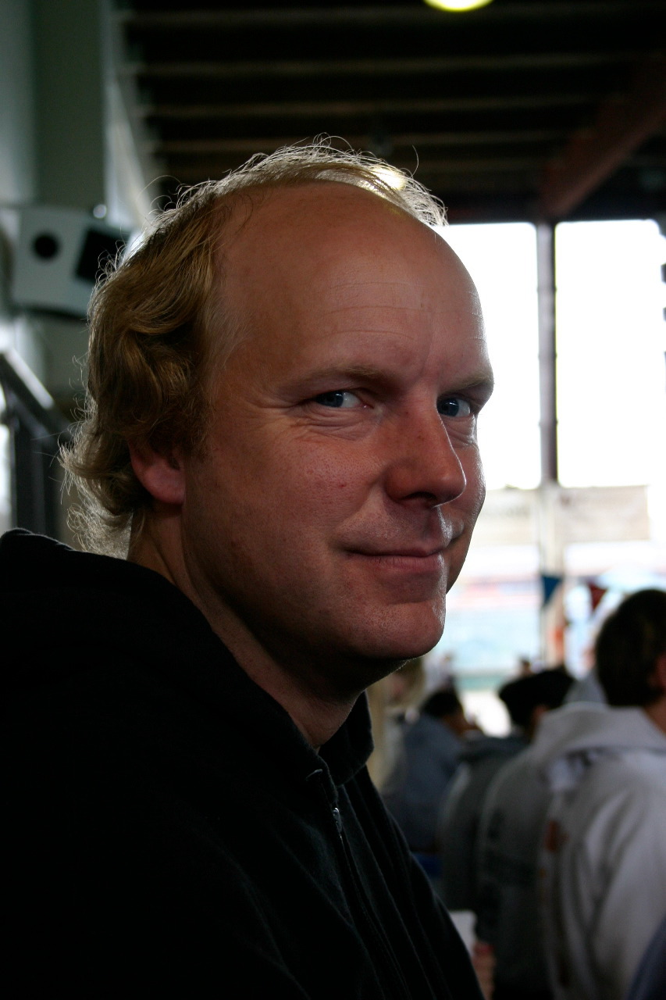

!SLIDE 
.notes first slide

## Programación Extrema, aceptar el cambio #
Meetup Rubylit 7 de febrero 2013

!SLIDE transition=fade
# ¿Qué es XP?

Ágil, Eficiente, Bajo riesgo, predecible, científica, divertida.

Disciplina para desarrollar Software

!SLIDE transition=fade

*"I always thought that Smalltalk would beat Java, I just didn’t know that it would be called" ‘Ruby’ when it did.* — Kent Beck

!SLIDE transition=fade
# ¿Por qué eXtrema?

Todas las practicas de sentido común al extremo

# \m/

!SLIDE 
.notes  Revisiones de código todo el tiempo, Testear todo el tiempo incluso con el cliente, El diseño como ocupación diaria de *todos*, La cosa más sencilla que pueda llegar a funcionar, Todos refinaran la arquitectura todo el tiempo.

* Pair Programming
* Units Test + Acceptance Test
* Refactoring
* Kiss
* Metafora
* Integration tests
* Iteraciones cortas segundos, minutos, horas.

!SLIDE transition=fade
.notes Trabajar en cosas que realmente importan, cada día. No van a enfrentar situaciones aterradoras solos. Van a provechar todas sus energías para que su sistema tenga éxito. Tomarán las decisiones que puedan tomar mejor

# XP promete a los programadores:

* Trabajar en lo importante
* No más situaciones en soledad
* Energía para el éxito
* Mejores decisiones 

!SLIDE transition=fade
.notes En resúmen XP promete reducir el riesgo del proyecto, mejorando
la sensibilidad a los cambios del negocio, mejorando la productividad
a lo largo de la vida del sistema; y añade diversión a la construcción de software en equipo --todo al mismo--.Es cierto. No se ría. Ahora van a tener que 
escuchar el resto de la charla para ver si estoy Loco

# XP promete a los clientes y directivos:

* El mayor valor posible cada semana
* Progresos concretos
* Cambiar la direccion a la mitad sin gran costo

!SLIDE transition=fade

# Si! en serio!

Ahora van a tener que escuchar el resto de la charla
para ver si estoy loco.

!SLIDE transition=fade

# El riesgo

El desarrollo de software fracasa en la entrega y en la entrega de valor.

## Impacto Económico y Humano

!SLIDE transition=fade

* Retrasos de planificación
* Proyecto cancelado
* El sistema se deteriora
* Alto nivel de bugs
* Requisitos mal comprendidos
* Cambios del negocio
* Falsa riquesa de características
* Cambios de personal

!SLIDE transition=fade

# El costo del cambio

Crece exponencialmente con el tiempo

!SLIDE transition=fade

# Esta curva no siempre es válida.

Tecnología + Prácticas de codificación = Curva ** -1 

!SLIDE transition=fade

# Para que nuestro código sea más fácil de modificar, tenemos que:

!SLIDE transition=fade

# Diseño simple

sin elementos extras, es decir 
sin ideas que no vamos a usar ahora pero que esperamos usar en el futuro.

!SLIDE transition=fade

# Pruebas automatizadas

con ellas tendremos la confianza en que conoceremos
si cambiamos accidentalmente el comportamiento del sistema.

!SLIDE transition=fade

# Adquirir práctica en modificar el diseño
de tal forma que cuando vienen los tiempos de cambio al sistema,
no tendremos miedo al tratarlos.

!SLIDE transition=fade

* Diseño sencillo
* Tests + Actitud de refinamiento constante

# =

Achatamiento de la curva del costo de desarrollo

!SLIDE transition=fade

# Cuatro valores

* Comunicación
* Sencillez
* Realimentación
* Valentía

!SLIDE transition=fade

!SLIDE transition=fade

# Comunicación

A veces un programador no le dice a otro algún cambio crítico
en el diseño del sistema.

A veces un programador no hace al cliente la pregunta adecuada

!SLIDE transition=fade

#Probar, emparejarse y estimar

hacen que programadores, clientes
y directores se tengan que comunicar.

!SLIDE transition=fade

# Sencillez

## ¿Qué es lo más simple que pueda llegar a funcionar?

La sencillez no es fácil. Una de las cosas más difíciles del mundo
es no mirar lo que necesitarás implementar mañana, la próxima semana
y el próximo mes.

!SLIDE transition=fade

*"No me preguntes a mí, pregúntale al sistema"*

*"¿Has escrito los casos de prueba para esto?"*

# Realimentación

!SLIDE transition=fade

*"El caucho tiene que tocar el asfalto"*

Hay que poner las historias más importantes en producción 
tan pronto como sea posible.

# Realimentación

El desarrollo es un estado temporal del sistema,
este necesita cobrar vida propia

# Producción

!SLIDE transition=fade

# Valentía

* Tirar código 
* Probar 3 diseños distintos 
  (uno por día)
* La comunicación apoya la valentía 
  (no me gusta esto!)
* Experimentos de alto riesgo y grandes recompensas

!SLIDE transition=fade

# Algunos principios

* Enseñar a aprender
* Pequeñas inversiones iniciales
* Jugar a ganar
* Experimentos concretos

!SLIDE transition=fade

#  Trabajar con los instintos de las personas, no contra ellos

!SLIDE transition=fade

# A las personas les gusta **ganar**

!SLIDE transition=fade

# A las personas les gusta **aprender** 

!SLIDE transition=fade

# A las personas les gusta **relacionarse con otras personas**

!SLIDE transition=fade

!SLIDE transition=fade

# A las personas les gusta  **formar parte de un equipo**

!SLIDE transition=fade

# A las personas les gusta **estar bajo control**

!SLIDE transition=fade

# A las personas les gusta **ser leales**

!SLIDE transition=fade

# A las personas les gusta **hacer bien su trabajo**

!SLIDE transition=fade

# A las personas les gusta **que su software funcione**

!SLIDE transition=fade

* Aceptar la responsabilidad
* Adaptación particular
* Ir liviano de equipaje
* Medidas honestas

!SLIDE transition=fade

# Codificar, probar, escuchar, diseñar

!SLIDE transition=fade

# Test infected

Cualquier cosa que no pueda ser medida no existe.
Las características de software que no puedan ser demostradas
mediante pruebas automatizadas, simplemente no existen.

!SLIDE transition=fade

# A largo plazo

Las pruebas automatizadas mantienen el el programa vivo
más tiempo, cuando las tienes puedes hacer más cambios
duramente más tiempo.

!SLIDE transition=fade

# A corto plazo

Es más divertido programar con tests que sin ellos.
Te dan más confianza.
*Es lindo ver que todo está verde.* 

!SLIDE transition=fade

!SLIDE transition=fade

# Recursos:

[http://xprogramming.com/](http://xprogramming.com/)

[Extreme Programming Explained: Embrace Change: Kent Beck](http://www.amazon.com/Extreme-Programming-Explained-Embrace-Change/dp/0201616416)

!SLIDE transition=fade
# Muchas gracias por escuchar

@gastonramos

[http://gastonramos.com.ar](http://gastonramos.com.ar)
